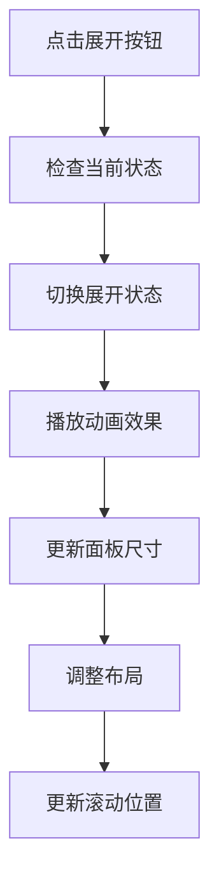
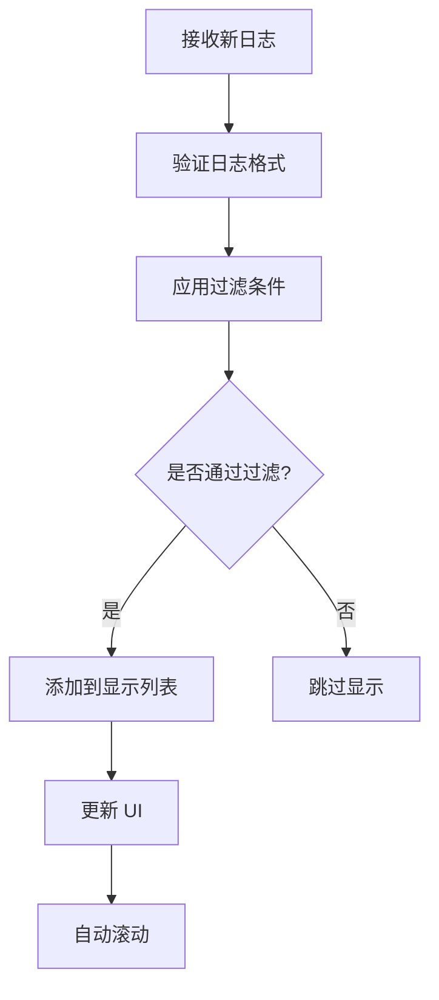
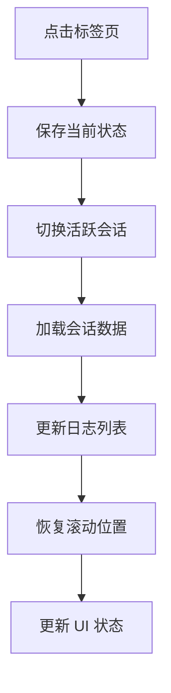

# LogPanel 日志面板组件模块

LogPanel 模块是 QuAIz 应用中负责日志展示和实时反馈的核心 UI 组件模块，为用户提供透明的操作过程展示和调试信息查看功能。

## 📁 目录结构

```
LogPanel/
├── LogPanel.tsx             # 日志面板主组件
├── LogEntry.tsx             # 单个日志条目组件
├── StreamSession.tsx        # 流式会话组件
├── TabHeader.tsx            # 标签页头部组件
├── PanelHeader.tsx          # 面板头部组件
├── components/              # 子组件目录
│   ├── LogFilter.tsx        # 日志过滤器
│   ├── LogSearch.tsx        # 日志搜索
│   ├── ExportButton.tsx     # 导出按钮
│   └── index.ts             # 组件导出
├── hooks/                   # 自定义 Hooks
│   ├── useLogPanel.ts       # 日志面板逻辑
│   ├── useLogFilter.ts      # 日志过滤逻辑
│   └── index.ts             # Hooks 导出
├── utils/                   # 工具函数
│   ├── logFormatter.ts      # 日志格式化
│   ├── logExporter.ts       # 日志导出
│   └── index.ts             # 工具导出
└── index.ts                 # 模块统一导出
```

## 🎯 核心功能

### 1. 实时日志展示
- **实时更新**: 日志条目的实时添加和更新
- **流式显示**: 支持 AI 流式回复的实时展示
- **自动滚动**: 新日志的自动滚动到底部
- **状态指示**: 清晰的日志状态和类型指示

### 2. 多会话管理
- **会话切换**: 在不同日志会话间切换查看
- **会话状态**: 实时显示会话的活跃状态
- **会话历史**: 保持会话的历史记录
- **会话清理**: 自动清理过期会话

### 3. 交互功能
- **展开收起**: 面板的展开和收起功能
- **日志过滤**: 按类型、级别过滤日志
- **搜索功能**: 在日志中搜索特定内容
- **导出功能**: 导出日志到文件

## 📋 主要组件

### LogPanel - 日志面板主组件
- **文件**: `./LogPanel.tsx`
- **功能**: 日志面板的主要容器组件
- **特性**:
  - 面板展开/收起控制
  - 多标签页管理
  - 日志列表渲染
  - 实时更新处理
  - 响应式布局

### LogEntry - 日志条目组件
- **文件**: `./LogEntry.tsx`
- **功能**: 单个日志条目的渲染组件
- **特性**:
  - 多种日志类型支持
  - 时间戳格式化
  - 内容语法高亮
  - 展开/收起详情
  - 状态图标显示

### StreamSession - 流式会话组件
- **文件**: `./StreamSession.tsx`
- **功能**: 显示 AI 流式回复的会话组件
- **特性**:
  - 流式内容实时渲染
  - 打字机效果
  - 会话状态指示
  - 内容格式化
  - 错误状态处理

### TabHeader - 标签页头部
- **文件**: `./TabHeader.tsx`
- **功能**: 多标签页的头部导航组件
- **特性**:
  - 标签页切换
  - 活跃状态指示
  - 关闭标签功能
  - 新建标签按钮
  - 标签页拖拽排序

### PanelHeader - 面板头部
- **文件**: `./PanelHeader.tsx`
- **功能**: 日志面板的头部工具栏
- **特性**:
  - 面板标题显示
  - 工具按钮组
  - 状态指示器
  - 设置菜单
  - 最小化/最大化控制

## 🔧 子组件

### LogFilter - 日志过滤器
- **文件**: `./components/LogFilter.tsx`
- **功能**: 日志过滤和筛选功能
- **特性**:
  - 按类型过滤
  - 按级别过滤
  - 按时间范围过滤
  - 自定义过滤条件

### LogSearch - 日志搜索
- **文件**: `./components/LogSearch.tsx`
- **功能**: 在日志中搜索特定内容
- **特性**:
  - 关键词搜索
  - 正则表达式搜索
  - 搜索结果高亮
  - 搜索历史记录

### ExportButton - 导出按钮
- **文件**: `./components/ExportButton.tsx`
- **功能**: 导出日志数据到文件
- **特性**:
  - 多种导出格式
  - 选择性导出
  - 导出进度显示
  - 导出设置配置

## 🎮 自定义 Hooks

### useLogPanel - 日志面板逻辑
- **文件**: `./hooks/useLogPanel.ts`
- **功能**: 管理日志面板的状态和逻辑
- **提供功能**:
  - `isExpanded` - 面板展开状态
  - `togglePanel()` - 切换面板状态
  - `activeTab` - 当前活跃标签
  - `switchTab()` - 切换标签页

### useLogFilter - 日志过滤逻辑
- **文件**: `./hooks/useLogFilter.ts`
- **功能**: 管理日志过滤和搜索逻辑
- **提供功能**:
  - `filteredLogs` - 过滤后的日志列表
  - `setFilter()` - 设置过滤条件
  - `searchTerm` - 搜索关键词
  - `setSearchTerm()` - 设置搜索词

## 🛠️ 工具函数

### logFormatter.ts - 日志格式化
- **功能**: 日志内容的格式化处理
- **提供方法**:
  - `formatLogMessage()` - 格式化日志消息
  - `formatTimestamp()` - 格式化时间戳
  - `highlightSyntax()` - 语法高亮处理
  - `truncateMessage()` - 消息截断处理

### logExporter.ts - 日志导出
- **功能**: 日志数据的导出处理
- **提供方法**:
  - `exportToJSON()` - 导出为 JSON 格式
  - `exportToCSV()` - 导出为 CSV 格式
  - `exportToTXT()` - 导出为文本格式
  - `generateReport()` - 生成日志报告

## 🎨 设计特点

### 视觉设计
- **现代界面**: 现代化的 UI 设计风格
- **色彩编码**: 使用颜色区分不同日志类型
- **图标语言**: 直观的图标和状态指示
- **动画效果**: 平滑的展开收起动画

### 用户体验
- **即时反馈**: 实时的日志更新和状态反馈
- **操作便捷**: 便捷的操作和快捷键支持
- **信息层次**: 清晰的信息层次和优先级
- **错误处理**: 友好的错误提示和处理

### 性能优化
- **虚拟滚动**: 大量日志时的虚拟滚动
- **懒加载**: 按需加载日志详情
- **内存管理**: 自动清理过期日志
- **渲染优化**: 避免不必要的重新渲染

## 🔄 交互流程

### 面板展开流程


### 日志添加流程


### 会话切换流程


## 📊 数据结构

### 面板状态结构
```typescript
interface LogPanelState {
  isExpanded: boolean;
  activeTabId: string;
  tabs: LogTab[];
  position: 'bottom' | 'right' | 'floating';
  size: { width: number; height: number };
}
```

### 标签页结构
```typescript
interface LogTab {
  id: string;
  title: string;
  type: 'general' | 'generation' | 'grading';
  sessionId?: string;
  isActive: boolean;
  hasNewLogs: boolean;
  logCount: number;
}
```

### 显示日志结构
```typescript
interface DisplayLogEntry {
  id: string;
  timestamp: number;
  type: 'info' | 'warning' | 'error' | 'debug';
  level: 'low' | 'medium' | 'high' | 'critical';
  message: string;
  formattedMessage?: string;
  isExpanded?: boolean;
  metadata?: Record<string, unknown>;
}
```

## 🎮 交互特性

### 键盘快捷键
- **Ctrl/Cmd + L**: 切换日志面板
- **Ctrl/Cmd + F**: 打开搜索
- **Ctrl/Cmd + E**: 导出日志
- **Esc**: 关闭搜索或面板
- **Tab**: 在标签页间切换

### 鼠标交互
- **双击**: 展开/收起日志详情
- **右键**: 显示上下文菜单
- **拖拽**: 调整面板大小
- **滚轮**: 滚动日志列表

### 触摸支持
- **滑动**: 在标签页间滑动切换
- **长按**: 显示更多操作选项
- **双击**: 展开/收起详情
- **捏合**: 调整字体大小

## 📱 响应式适配

### 桌面端 (lg+)
- **侧边面板**: 可停靠的侧边面板模式
- **多标签**: 完整的多标签页功能
- **工具栏**: 完整的工具栏和操作按钮
- **拖拽**: 支持面板拖拽和调整大小

### 平板端 (md-lg)
- **浮动面板**: 浮动的日志面板
- **简化工具栏**: 简化的工具栏
- **触摸优化**: 适合触摸的按钮大小
- **自适应**: 根据屏幕方向调整布局

### 移动端 (< md)
- **全屏模式**: 全屏的日志查看模式
- **底部面板**: 底部滑出的面板
- **简化界面**: 简化的用户界面
- **手势操作**: 支持手势操作

## 🔗 集成方式

### 全局日志面板提供者
```typescript
import { LogPanelProvider } from '@/components/LogPanel';

const App = () => {
  return (
    <LogPanelProvider>
      <Router>
        {/* 应用路由 */}
      </Router>
    </LogPanelProvider>
  );
};
```

### 在页面中使用日志
```typescript
import { useLogPanel } from '@/components/LogPanel';

const GenerationPage = () => {
  const { addLog, showPanel } = useLogPanel();
  
  const handleGenerate = async () => {
    addLog({
      type: 'info',
      message: '开始生成题目'
    });
    
    showPanel(); // 显示日志面板
    
    try {
      // 生成逻辑
    } catch (error) {
      addLog({
        type: 'error',
        message: '生成失败',
        metadata: { error }
      });
    }
  };
  
  return (
    <div>
      {/* 页面内容 */}
    </div>
  );
};
```

### 自定义日志格式化
```typescript
import { registerLogFormatter } from '@/components/LogPanel';

// 注册自定义格式化器
registerLogFormatter('api-call', (log) => {
  return {
    ...log,
    formattedMessage: `🌐 API: ${log.message}`,
    icon: 'api',
    color: 'blue'
  };
});
```

## 🔗 相关模块

- **日志存储**: `../../stores/logStore/` - 日志数据存储和管理
- **主应用**: `../LogPanelProvider.tsx` - 全局日志面板提供者
- **生成页面**: `../../pages/generation/` - 题目生成过程日志
- **答题页面**: `../../pages/quiz/` - 答题过程日志
- **结果页面**: `../../pages/result/` - 批改过程日志

## 🚀 性能优化

### 渲染优化
- **虚拟滚动**: 大量日志时使用虚拟滚动
- **组件缓存**: 缓存日志条目组件
- **懒加载**: 按需加载日志详情
- **防抖**: 搜索和过滤的防抖处理

### 内存管理
- **日志限制**: 限制内存中的日志数量
- **自动清理**: 自动清理过期日志
- **分页加载**: 历史日志的分页加载
- **压缩存储**: 压缩存储大量日志数据

### 网络优化
- **批量更新**: 批量处理日志更新
- **增量同步**: 增量同步日志数据
- **离线支持**: 离线状态下的日志缓存
- **重连机制**: 网络断开后的重连机制

## 🛠️ 开发工具

### 调试功能
- **日志级别**: 可调节的日志级别
- **调试模式**: 开发环境的调试模式
- **性能监控**: 日志面板的性能监控
- **错误追踪**: 错误的详细追踪信息

### 配置选项
- **主题设置**: 可配置的主题和样式
- **布局设置**: 可调整的布局和位置
- **过滤设置**: 可保存的过滤配置
- **导出设置**: 可配置的导出选项

## 👨‍💻 开发者

- **作者**: JacksonHe04
- **项目**: QuAIz - AI 智能刷题系统
- **模块**: 日志展示和实时反馈核心 UI 组件